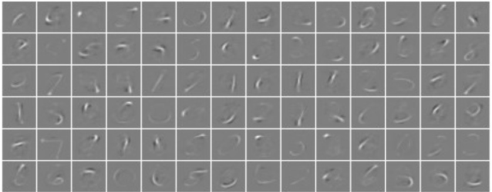

<!-- class: title -->

論文紹介 2026/04/07

畳み込みニューラルネットワーク入門

  

    
理学部　化学科

    
知能　太郎

  

---
<!-- class: agenda show-page -->

  
アジェンダ

  

    
1. はじめに：ANNの課題

    
2. CNNとは？

    
3. CNNの基本構造

    
4. 主要な層の役割

    
5. CNN構築のレシピ

    
6. まとめ

  

---
<!-- class: content-gray show-page -->

## 1. はじめに：ANNの課題
従来の人工ニューラルネットワーク（ANN）は画像認識に課題がありました

*   **画像の高次元性**
    *   高解像度のカラー画像を入力すると、パラメータ数が爆発的に増加
    *   例：64×64ピクセルのカラー画像では、最初の層のニューロン1つに12,288個の重みが必要 (64×64×3)

*   **過学習 (Overfitting)**
    *   パラメータが多すぎると、訓練データに過剰に適合
    *   未知のデータに対する汎化性能が低下するリスク

 
→ 画像の特性を考慮した、より効率的なアーキテクチャが必要です

---
<!-- class: content-gray show-page -->

## 2. CNNとは？
Convolutional Neural Network (畳み込みニューラルネットワーク) の略称です

*   **画像処理に特化したニューラルネットワーク**
    *   入力データが画像であることを前提に設計
    *   生物の視覚野の仕組みにヒントを得ています

*   **ANNとの主な違い**
    *   ニューロンを3次元（縦・横・深さ）に配置
    *   ニューロンは前の層の一部分（局所領域）にのみ接続

 
画像の持つ「空間的な局所性」を活かすことで、パラメータ数を大幅に削減します

---
<!-- class: content-gray show-page -->

## 3. CNNの基本構造
CNNは主に3種類の層を積み重ねて構成されます

[図: ここにシンプルなCNNアーキテクチャの図を入れる (Figure 2)]

 

*   **畳み込み層 (Convolutional Layer)**
    *   画像からエッジや模様などの局所的な特徴を抽出します

*   **プーリング層 (Pooling Layer)**
    *   特徴を維持したまま、データの次元を削減します

*   **全結合層 (Fully-connected Layer)**
    *   抽出された特徴を統合し、最終的な分類を行います

---
<!-- class: content-gray show-page -->

## 4. 主要な層の役割 (1/4)

  

    <h3>畳み込み層: 特徴の抽出</h3>
    <ul>
      <li>学習可能なフィルタ（カーネル）で画像上を走査</li>
      <li>エッジやコーナー等の特徴マップ（Activation Map）を生成</li>
      <li>パラメータ共有の仕組みにより、少ないパラメータで学習可能</li>
    </ul>
     
    

      活性化関数には主にReLU (Rectified Linear Unit) が使われます。
    

  

  

Fig. 3: Activations taken from the first convolutional layer of a simplistic deep
    

       
      カーネルを適用し、特徴を抽出する様子
    

  

---
<!-- class: content-gray show-page -->

## 4. 主要な層の役割 (2/4)
畳み込み層の出力サイズは、以下の式で計算できます

$$
\frac{(V - R + 2Z)}{S} + 1
$$

*   $V$: 入力ボリュームのサイズ (縦 or 横)
*   $R$: 受容野 (カーネル) のサイズ
*   $Z$: ゼロパディングの量
*   $S$: ストライド (カーネルの移動量)

 
ハイパーパラメータ (R, Z, S) を調整することで、出力サイズを制御します。

---
<!-- class: content-gray show-page -->

## 4. 主要な層の役割 (3/4)
プーリング層は、特徴マップを圧縮して計算量を削減します

*   **次元削減 (ダウンサンプリング)**
    *   特徴マップの空間的次元（縦・横）を小さくする
    *   計算コストの削減と過学習の抑制に貢献

*   **Max-pooling**
    *   領域内の最大値を取る手法が一般的
    *   特徴の微小な位置ずれに対して頑健（位置不変性）になる効果

 
これにより、より本質的な特徴を保持したまま、効率的な処理が可能になります

---
<!-- class: content-gray show-page -->

## 4. 主要な層の役割 (4/4)
全結合層は、抽出された特徴から最終的な識別を行います

*   **特徴の統合と分類**
    *   畳み込み層・プーリング層で抽出されたすべての特徴を入力
    *   最終的なクラス分類のスコアを出力

*   **従来のANNと同じ構造**
    *   ニューロンが隣接する層の全てのニューロンと結合

[図: ここにFNNの基本構造図を入れる (Figure 1)]

---
<!-- class: content-gray show-page -->

## CNNは何を学習しているのか？
学習済みのフィルタを可視化すると、CNNが捉えている特徴が分かります

Fig. 3: Activations taken from the first convolutional layer of a simplistic deep

*   MNIST（手書き数字）データセットで学習したCNNの例
*   最初の畳み込み層は、エッジやストロークといった低レベルな特徴を自動で学習していることが分かります
*   層が深くなるにつれて、これらの特徴を組み合わせ、より複雑な特徴（数字のパーツなど）を捉えていきます

---
<!-- class: content-gray show-page -->

## 5. CNN構築のレシピ
効率的なCNNを構築するための基本的な指針があります

*   **基本パターン**
    *   畳み込み層とプーリング層を交互に重ね、最後に全結合層を配置

*   **推奨パターン**
    *   プーリング層の前に複数の畳み込み層を重ねる
    *   より複雑で表現力の高い特徴を抽出可能

Fig. 3: Activations taken from the first convolutional layer of a simplistic deep

*   **Tips**
    *   フィルタサイズは小さく（例：3×3）、層を深くする方が性能が良い傾向
    *   入力画像のサイズは2のべき乗（32, 64, 128...）が一般的

---
<!-- class: content-gray show-page -->

## 6. まとめ
本発表の要点です

*   CNNは画像の特性を活かした効率的なアーキテクチャ
    *   局所結合とパラメータ共有により、従来のANNのパラメータ爆発問題を解決

*   3つの主要な層で構成
    *   畳み込み層（特徴抽出）、プーリング層（次元削減）、全結合層（分類）の組み合わせ

*   階層的な特徴学習
    *   単純な特徴（エッジ）から複雑な特徴（物体のパーツ）へと段階的に学習

 
本論文は、CNNの基本を理解し、画像認識モデルを構築するための優れた入門となります